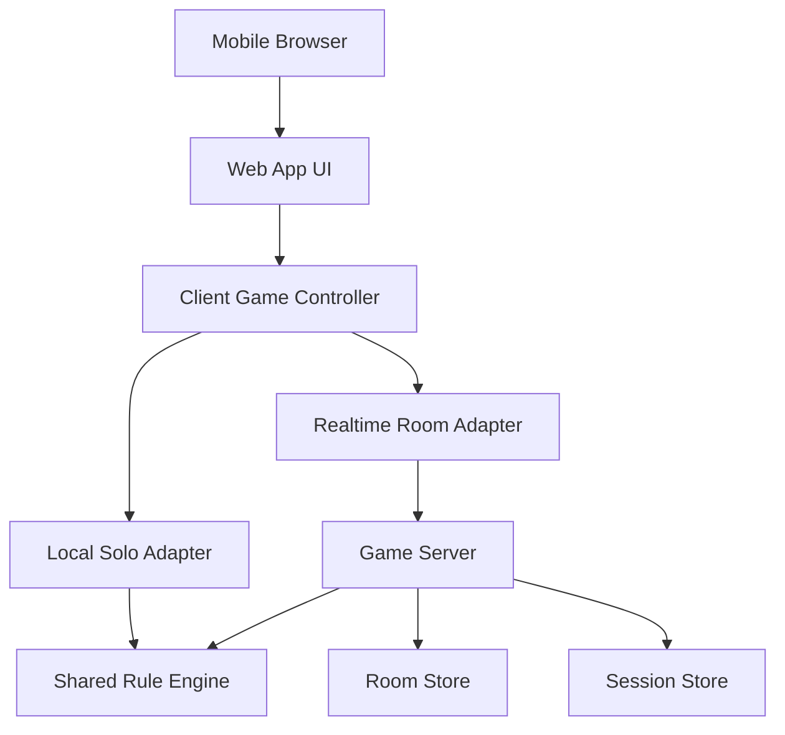

# Hangzhou Mahjong Web Game

Feature Name: hangzhou-mahjong-web-game
Updated: 2026-05-13

## Description

杭州麻将网页游戏采用移动端优先的 Web 架构，提供单机 AI 对战和好友房实时联机。核心设计目标是把杭州麻将规则判定集中在共享规则引擎中，让单机、联机、回放和测试使用同一套牌局状态机与计分逻辑。

## Architecture



前端负责移动端渲染、触屏输入和玩家视角状态展示。服务端负责联机房间、操作校验、状态广播和断线重连。规则引擎以纯逻辑模块形式存在，前端单机模式和服务端联机模式共同复用规则引擎。

## Components and Interfaces

### Web App UI

提供首页、单机牌桌、联机房间等待页、联机牌桌、结算页和规则配置页。UI 只消费玩家视角数据，避免直接依赖完整牌局状态。

### Client Game Controller

管理页面路由、玩家输入、动画节奏、倒计时展示和本地状态缓存。控制器通过统一接口调用单机适配器或联机适配器。

### Local Solo Adapter

在浏览器本地创建牌局，驱动 AI 玩家行动，并把未完成牌局保存到本地存储。单机模式使用共享规则引擎直接推进状态。

### Realtime Room Adapter

通过 WebSocket 与服务端交换房间事件。适配器提交玩家操作，接收服务端广播的玩家视角快照和结算事件。

### Game Server

提供创建房间、加入房间、开始牌局、提交操作、重连恢复和房间结算接口。服务端持有联机牌局权威状态，并调用规则引擎验证所有操作。

### Shared Rule Engine

负责牌组建模、发牌、轮转、合法操作计算、吃碰杠胡判定、番型判定和计分。规则引擎输入当前牌局状态和动作，输出新的牌局状态、可见事件和结算结果。

## Data Models

```typescript
type Tile = {
  suit: 'wan' | 'tiao' | 'tong' | 'feng' | 'jian';
  rank: number;
  id: string;
};

type PlayerState = {
  playerId: string;
  seat: 0 | 1 | 2 | 3;
  hand: Tile[];
  melds: Meld[];
  discards: Tile[];
  score: number;
  connected: boolean;
};

type GameState = {
  roomId: string;
  phase: 'waiting' | 'dealing' | 'playing' | 'settlement';
  dealerSeat: 0 | 1 | 2 | 3;
  currentSeat: 0 | 1 | 2 | 3;
  wall: Tile[];
  players: PlayerState[];
  pendingAction?: PendingAction;
  ruleConfig: HangzhouRuleConfig;
};

type PlayerView = {
  self: PlayerState;
  opponents: PublicPlayerState[];
  publicState: PublicGameState;
  availableActions: PlayerAction[];
};
```

房间数据包含房间号、玩家会话、规则配置、牌局状态、历史结算和最近事件序列。联机模式只把 `PlayerView` 下发给对应玩家。

## Correctness Properties

- 牌墙、玩家手牌、玩家副露、玩家弃牌和已结算牌的总集合在牌局中保持守恒。
- 服务端是联机牌局的权威状态来源。
- 任一玩家只能看到玩家视角允许的数据。
- 每个动作必须基于当前状态生成的 `availableActions` 执行。
- 结算结果必须可由最终牌局状态和规则配置重复计算得到。
- AI 玩家只能提交合法动作集合中的动作。

## Error Handling

- 创建房间失败时，前端展示重试入口并保留玩家昵称。
- 加入房间失败时，服务端返回无效房间、房间已满或牌局已开始等明确原因。
- WebSocket 断开时，前端进入重连状态并暂停提交新动作。
- 重连成功时，服务端发送最新玩家视角快照覆盖本地联机状态。
- 操作校验失败时，服务端拒绝动作并返回当前可执行动作列表。
- 单机本地存储损坏时，前端清理损坏牌局并提示玩家重新开始。

## Test Strategy

- 规则引擎单元测试覆盖发牌、轮转、吃碰杠胡、番型和计分。
- 属性测试验证牌集合守恒和非法动作拒绝。
- AI 测试验证 AI 只输出合法动作。
- 服务端集成测试覆盖创建房间、加入房间、开始牌局、提交动作和断线重连。
- 前端组件测试覆盖移动端牌桌布局、操作按钮显示和结算详情展示。
- 端到端测试覆盖单机开局、联机建房加入、出牌响应、结算和重连恢复。

## Open Decisions

- 首版采用基础杭州麻将规则优先，牌组包含东、南、西、北、中、发、白，白板为财神并作为百搭牌参与胡牌判定。
- 首版支持吃、碰、杠、过和自摸胡，杭州麻将无点炮，弃牌响应只触发吃、碰、杠、过。
- 首版限制每名玩家最多吃两次，碰牌次数不限。
- 首版区分庄家和闲家，庄家参与输赢时按 8 倍结算。
- 首版胡法翻数：平胡 1 翻，有财神的敲响 2 翻，七小对子无财神 4 翻，七小对子有财神 2 翻，七小对子有财神敲响 4 翻；三财胡额外 1 翻，四财胡额外 2 翻；财飘一次额外 1 翻，财飘两次额外 2 翻。
- 首版摸牌后通过 `drawnTileId` 标记新摸牌，前端用金色光圈和“新摸”标识区分。
- 承包、飘财、爆头、杠开、抢杠胡等本地变体通过后续规则配置扩展。
- 首版按四人麻将设计。
- 首版使用游客昵称和房间号进入联机房间。
- 首版目标是可玩的移动端 Web MVP，包含单机、基础联机和核心规则。

## References

[^1]: (requirements.md) - 杭州麻将网页游戏需求文档
